# Visual QA: UI defects found by screenshot review

**App:** LMS admin and student interfaces, run locally against a seeded database
**Date:** 23 September 2026
**Commit:** `04a679e` — every `file:line` below was re-checked against this commit
**Viewport:** 1280×720 (desktop only)
**Coverage:** 91 states captured across 7 features, 222 images

Every state of the app that a person could reasonably reach was driven with Playwright,
photographed, and each screenshot checked against a fixed list of 85 named UI defects.
Candidate findings then went to a second, separate review whose only job was to knock them
down. 53 candidates were produced and 3 were refuted.

**No fix in this report has been applied.** Every "Fix" line is a proposal. Two unrelated
changes were made to the repo during this pass — a broken seed script and a `.gitignore`
line — both listed under [Repairs made](#repairs-made).

## Severity key

- **Blocking** — the user cannot do what they came to do.
- **Degraded** — it works, but it is wrong.
- **Cosmetic** — it looks unpolished.

## Start here

Ranked by real-world harm, which is not the same as the severity label. The labels follow a
fixed catalogue definition; this list is a judgement about what actually hurts people.

1. **[Students are told their correct answers are wrong](#1-students-are-told-their-correct-answers-are-wrong)** — a red "wrong" chip on every answer a student picked, whenever results are withheld. Labelled Degraded because nothing is blocked, but this is the one to fix first.
2. **[`/redirect` returns HTTP 500 to any signed-out visitor](#2-redirect-returns-http-500-to-any-signed-out-visitor)** — the code path written to break a redirect loop is the one that crashes.
3. **[The Add Question status banner renders as a full-height column](#3-the-add-question-status-banner-renders-as-a-full-height-column)** — the bug that prompted this pass, present in two files.
4. **[Multi-select partial credit can never be switched on](#4-multi-select-partial-credit-can-never-be-switched-on)** — a scoring mode that exists in the data model, the grading code and the UI labels, but has no control anywhere.
5. **[A student who left a question blank is shown as fully graded](#5-a-student-who-left-a-question-blank-is-shown-as-fully-graded)** — the teacher never awards the zero.

## Counts

- **52 findings** — 2 blocking, 37 degraded, 13 cosmetic
- **37** matched a named entry in the defect catalogue; **15** did not — see [Noticed, but not on the checklist](#noticed-but-not-on-the-checklist)
- **9 root causes** account for 27 of the 52 entries
- The 52 entries are **48 distinct defects** — see [Entries that are one defect](#entries-that-are-one-defect)

**How 52 was arrived at.** The screenshot review produced 53 candidates; the adversarial pass
refuted 3, of which one is kept here as finding 39 (the observation is sound, but the
catalogue entry it had been filed under does not fit it). That leaves 51 from the review.
Add three findings no screenshot produced — found by driving the app and reading code
([2](#2-redirect-returns-http-500-to-any-signed-out-visitor),
[4](#4-multi-select-partial-credit-can-never-be-switched-on),
[5](#5-a-student-who-left-a-question-blank-is-shown-as-fully-graded)) — and subtract two
candidates that described one defect in two features and were merged. 51 + 3 − 2 = **52**.

---

## Root causes

Fixing these nine things resolves 27 of the 52 entries. They are worth reading before the
individual findings.

### RC1 — Long unbroken strings have no wrapping rule anywhere (7 findings)

A pasted email address, URL or ID used as a course, test or pool name — or typed into a
student's answer — has no space to break at. Nothing in the app tells it to break anyway, so
it sets a minimum width wider than the window and drags the whole page sideways.

This is measurable rather than a matter of opinion. Each capture is clipped to
`document.documentElement.scrollWidth`, so a capture wider than 1280px *is* horizontal
overflow. **86 of 91 states are exactly 1280px. Five are not**, and all five are this cause:

- `grading/course-scoped-unreleased` — 1462px
- `courses/detail-unbroken-title` — 1412px
- `grading/empty-roster-unbroken-title`, `grading/grades-released`, `pools/detail-unbroken-name` — 1301px

**One fix covers these:** add `overflow-wrap: anywhere` to the headings and text blocks that
render user-supplied values, and `min-w-0` to their flex/grid parents. Without the `min-w-0`
the parent refuses to shrink and the wrap rule never gets a chance to apply.

Covers findings 6, 7, 8, 10, 11, 15, 16.

### RC8 — Flex rows that neither shrink nor reserve space (4 findings)

Distinct from RC1, and originally misfiled under it. Here the text is ordinary prose with
spaces that wraps perfectly well — a Vietnamese course title, a student's display name. The
damage comes from the row it sits in: no `gap`, no `min-w-0` on the growing child, no
`shrink-0` on the thing being crushed. The long value takes the space and its neighbour
buckles, so a counter breaks in half inside its own pill or a badge is shoved out of column.

`overflow-wrap` would change nothing here. The fix is on the row, not the text.

Covers findings 12, 13, 14, 44.

### RC9 — Fixed-height chrome that cannot grow (1 finding)

The admin top bar is `h-12` with `items-center`. Anything taller than 48px is centred and
bleeds out of both ends of the bar, which is why the breadcrumb's first line is sliced off
above the top of the document where no scrolling can reach it.

Covers finding 9.

### RC2 — The add-question status banner is a flex sibling, not a banner (5 findings, 1 defect)

In both question-authoring forms the success `<output>` and the error `<div>` sit *inside*
the flex row that holds the type sidebar and the form panel. A flex row gives each child a
track, so the message becomes a third column running the full height of the card, and the
form collapses into what is left.

Covers findings 3, 17, 18, 19, 20. Both files need the same edit.

### RC3 — Test status is inferred from answer counts, not from what happened (3 findings)

`test-status-service.ts` derives status by counting answer rows rather than reading the
events that actually occurred (a start record, a submission record). So a test reads
"Not Started" while its clock is running, "Submitted" while it is still open and editable,
and a student who left a question blank counts as fully graded because a blank writes no row.

Covers findings 5, 21, 22.

### RC4 — Hiding the answer key repaints correct answers as wrong (1 finding)

The most damaging defect in the report, covered in full below. Covers findings 1.

### RC5 — Confirmations are unmounted before they can be seen (2 findings)

Two different mechanisms, same result: the user acts, it works, and the screen either says
nothing or says the opposite. Covers findings 23, 24.

### RC6 — Buttons that bypass the shared `Button` component (2 findings)

One primary action is a hand-rolled styled `<Link>`, another picks `size="lg"` where its
partner uses the default. Both leave mismatched pairs side by side. Covers findings 40, 41.

### RC7 — Three vocabularies for the same two concepts (2 findings)

Question types are named differently in three places, and the answer-display setting carries
three headings with three sets of option wordings. Covers findings 25, 26.

---

## Findings

Ordered by how much harm they do, not by severity label — severity is stated on
each finding. The labels follow fixed catalogue definitions, which do not always
agree with what actually hurts a user.

### 1. Students are told their correct answers are wrong

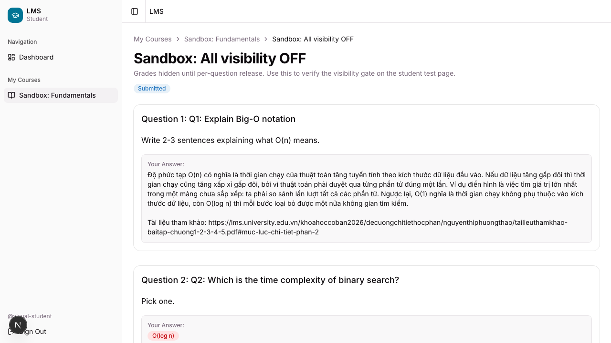

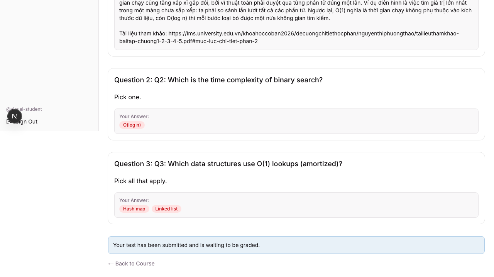

- **What's wrong:** On a test whose banner says it is *waiting to be graded*, every option the student picked is drawn as a red "wrong answer" chip. "O(log n)" is the correct answer to the binary-search question and "Hash map" is correct on the next one — both are red. The student has no grade yet to contradict the impression that they failed.
- **Where:** [mc-answer-chips.tsx:55-59](../src/components/mc-answer-chips.tsx#L55-L59) and [test-questions-section.tsx:97-101](../src/app/student/%28dashboard%29/courses/%5BcourseId%5D/tests/%5BtestId%5D/test-questions-section.tsx#L97-L101).
- **Why it happens:** When correct answers are withheld, the page scrubs the answer key before it reaches the browser — `question.options.map((o) => ({ ...o, isCorrect: false }))`. The comment above that line says this makes selected chips render in the *"neutral"* path. There is no neutral path. `McAnswerChips` has exactly three states, and `isSelected && !option.isCorrect` is the solid-red `selected-wrong` one. The privacy fix and the colour logic were written against different assumptions.
- **Fix:** Give `McAnswerChips` a fourth, genuinely neutral state. Pass an explicit flag (`correctnessKnown`) and, when it is false, style selected chips neutrally and never read `isCorrect` at all — rather than inferring wrongness from a field that has deliberately been blanked.
- **Severity:** Degraded by the catalogue's definition, since the student is not prevented from doing anything. Treat it as the top priority anyway: it tells every student who submits a test with results withheld that they got their right answers wrong.
- **Likelihood:** Every multiple-choice answer on every submitted test where correct answers have not been released.
- **Verification:** the chip pixels were sampled (background `rgb(255,226,226)`, text `rgb(193,0,7)` — the red branch), and the answer key was read from the database to confirm those options really are correct.

### 2. `/redirect` returns HTTP 500 to any signed-out visitor

- **What's wrong:** Opening `/redirect` without a session returns a 500 error page. Confirmed with a live request, not inferred: `curl -o /dev/null -w '%{http_code}' http://localhost:3011/redirect` → **500**.
- **Where:** [redirect/page.tsx:27](../src/app/redirect/page.tsx#L27), and the same call on the unknown-role fallback at [line 40](../src/app/redirect/page.tsx#L40).
- **Why it happens:** The page calls `cookieStore.delete("better-auth.session_token")` inside a Server Component. Next.js forbids cookie writes outside a Server Action or Route Handler, so the call throws and the render fails:
  ```
  ⨯ Error: Cookies can only be modified in a Server Action or Route Handler.
      at RedirectPage (src/app/redirect/page.tsx:27:23)
  ```
- **Why it matters:** The comment at [lines 14-15](../src/app/redirect/page.tsx#L14-L15) says this branch exists to clear a stale cookie and *prevent an infinite redirect loop*. The recovery path is the one that crashes, so a user whose session expired gets an error page instead of being sent home.
- **Fix:** Stop writing cookies from this page. Either move it to a Route Handler (`app/redirect/route.ts`), which may set cookies, or drop the delete entirely and just `redirect("/")` — the session is already invalid, so the stale cookie is inert and the login flow overwrites it.
- **Severity:** Blocking. Off-checklist — the catalogue's only error-screen entry requires a recovery action that fails the same way, and this page has none.
- **Likelihood:** Every signed-out or stale-session visit to `/redirect`.
- **Note:** this was found by driving the app, not from a screenshot. Its capture shows only the Next.js dev error overlay.

### 3. The Add Question status banner renders as a full-height column

This is the defect that prompted this pass. It is present in **two** files.

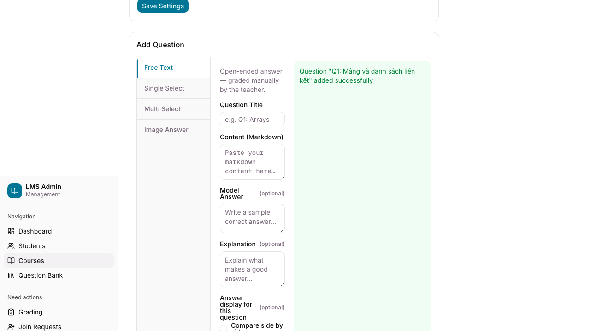

- **What's wrong:** After a submit, the message becomes a tall coloured column down the right of the card — one line of text at the top and several hundred pixels of empty colour below it — and the form panel collapses into what remains. At that width the labels break mid-phrase: "Model / Answer", "Answer / display for / this / question", and the file picker truncates to "Choose Files N…".
- **Where:**
  - [add-question-form.tsx:344-357](../src/app/admin/%28dashboard%29/courses/%5BcourseId%5D/tests/%5BtestId%5D/add-question-form.tsx#L344-L357), inside the flex row opened at [line 158](../src/app/admin/%28dashboard%29/courses/%5BcourseId%5D/tests/%5BtestId%5D/add-question-form.tsx#L158)
  - [add-pool-question-form.tsx:317-329](../src/app/admin/%28dashboard%29/pools/%5BpoolId%5D/add-pool-question-form.tsx#L317-L329), inside the flex row opened at [line 138](../src/app/admin/%28dashboard%29/pools/%5BpoolId%5D/add-pool-question-form.tsx#L138)
- **Why it happens:** Both status blocks are direct children of `<div className="flex gap-0 rounded-lg border overflow-hidden">`. A flex container gives every child its own track, so the message sits beside the sidebar and the form instead of below them. The `mt-2` on both messages is also a no-op inside a row.
- **Fix:** Close the flex row after the form column's `</div>`, then render both status blocks below it inside `<CardContent>`. They become full-width banners under the panel and the form keeps its width whether or not a message is showing.
- **Severity:** Degraded — the form still works, and the message is readable.
- **Likelihood:** Every submit of either form, success or validation failure.

---

### 4. Multi-select partial credit can never be switched on

- **What's wrong:** Every multi-select question in the product is all-or-nothing. A student who picks 2 of 3 correct options scores zero, and no teacher can change that.
- **Where:** [question-list.tsx:147-151](../src/app/admin/%28dashboard%29/courses/%5BcourseId%5D/tests/%5BtestId%5D/question-list.tsx#L147-L151) displays it; [grade-service.ts:134](../src/lib/grade-service.ts#L134) branches on it.
- **Why it happens:** `grep -rn 'name="mcGradingStrategy"' src` returns **zero** matches. The field exists in both schemas, is defaulted to `"all_or_nothing"`, is read by the grading code, and is *printed on screen* as "Grading: All-or-nothing" as though a teacher had chosen it — but no form control anywhere sets it. The AI import path hardcodes it with a comment conceding it has no source. The partial-credit branch in the grader is live code that nothing can reach.
- **Fix:** Either add the control to both add/edit forms — the schema and the grading logic are already in place and correct — or remove the "Grading:" line from `question-list.tsx` so the UI stops advertising a setting that does not exist. `scripts/instruction.md` documents this as a supported per-question option, which is true of the data model and false of the app.
- **Likelihood:** Every multi-select question ever authored through the UI.
- **Severity:** Degraded. Off-checklist — the catalogue has no entry for this, so the severity is an estimate.

### 5. A student who left a question blank is shown as fully graded

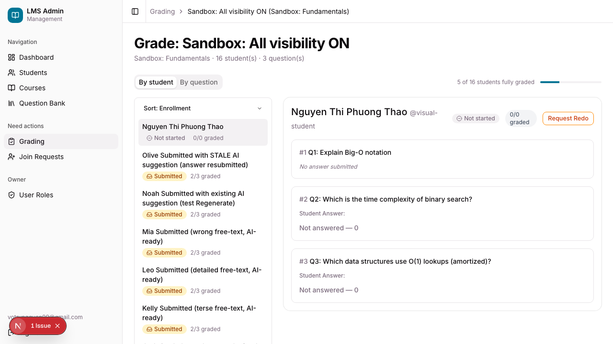

- **What's wrong:** A student who submits leaving a free-text question blank is badged as fully graded. Seeded student `dan` shows a green **"2/2 graded"**, so a teacher scanning for work to do skips him — and his blank answer never gets the zero it should.
- **Where:** [grading-page-shell.tsx:87-88](../src/app/admin/%28dashboard%29/grading/page-body/grading-page-shell.tsx#L87-L88) and [grading-detail-student.tsx:136](../src/app/admin/%28dashboard%29/grading/page-body/grading-detail-student.tsx#L136).
- **Why it happens:** `answeredCount` is derived from answer *rows*, and a blank answer writes none. The question vanishes from the denominator instead of counting as ungraded.
- **Fix:** Count questions, not answer rows — compare against the test's question count, or treat a missing row for a required question as ungraded.
- **Likelihood:** Any student who submits with a free-text question left blank.
- **Note:** your own seed script treats awarding that zero as a distinct expected state for a different student (`grace`, "graded with blank free-text, counted as 0"), which is what makes this a bug rather than a design choice.
- **Severity:** Degraded. Off-checklist — the catalogue has no entry for this, so the severity is an estimate.

### 6. The Export Results button is pushed entirely off screen

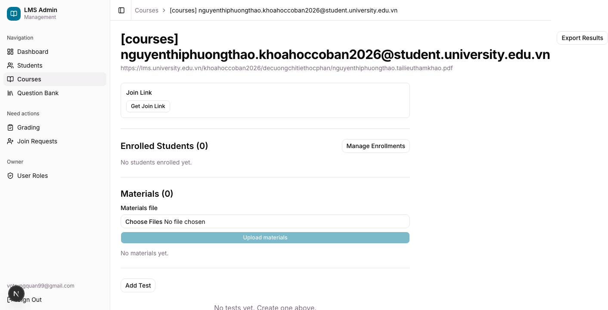

- **What's wrong:** On a course whose title is an unbroken string, the Export Results button is not on screen at all. Its left edge sits 13px beyond the window's right edge, so at rest none of it is visible — the admin must scroll the page sideways to find it.
- **Where:** [courses/[courseId]/page.tsx](../src/app/admin/%28dashboard%29/courses/%5BcourseId%5D/page.tsx).
- **Fix:** RC1. Wrap the title block in `min-w-0`, give the `h1` `overflow-wrap: anywhere`, and add `shrink-0` to the button.
- **Severity:** Blocking by the catalogue's definition of `element-offscreen`. Listed here rather than above because it needs a pasted-in title to trigger.
- **Likelihood:** Any course titled with an email address, URL or pasted ID.

### 7. The same course page scrolls sideways

Same capture as finding 6. The title runs to x=1276 and the description URL to x=1051, where every other section on the page stops at x=951. The sticky top bar's border ends at x=1279 while content continues to 1411, leaving a bare white strip beside it. **Fix:** RC1.
- **Severity:** Degraded.

### 8. A long reference link in a student's answer drags the grading page sideways

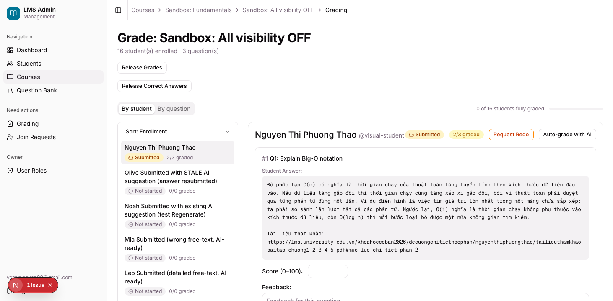

- **What's wrong:** The widest overflow in the pass — 1462px against a 1280 viewport, 182px of sideways scroll. The breadcrumb bar, page title and roster are all dragged out with it.
- **Where:** [grading-forms.tsx](../src/app/admin/%28dashboard%29/courses/%5BcourseId%5D/tests/%5BtestId%5D/grading/grading-forms.tsx).
- **Why it happens:** The URL does wrap, at its hyphens — but its first unbreakable segment is about 753px wide, and that sets the answer block's min-content width, which forces the grid's `1fr` detail column open.
- **Fix:** RC1 — `overflow-wrap: anywhere` on the answer block plus `min-w-0` on the detail column.
- **Likelihood:** Whenever a student pastes a URL into a free-text answer.
- **Severity:** Degraded.

### 9. The grading breadcrumb is sliced off by the top bar

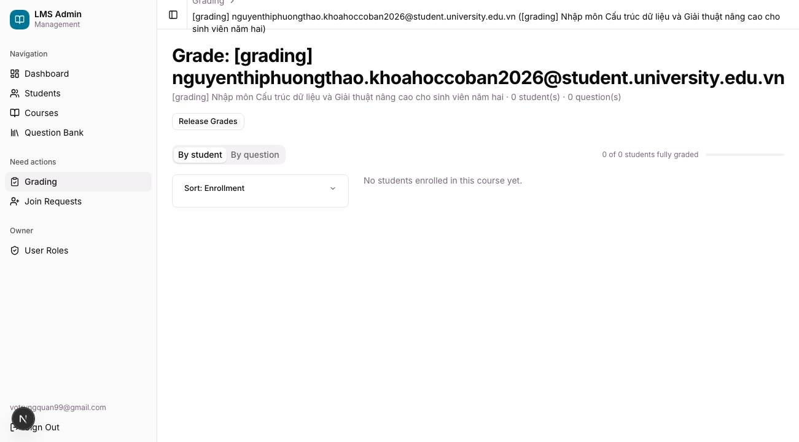

- **What's wrong:** With a long test title the breadcrumb wraps to three lines inside a fixed-height bar. The first line — the "Grading" link back to the hub — is cut horizontally by the top of the screen with only the bottom of its letters showing, and the last line sits on the bar's bottom border. At rest the cut line cannot be reached.
- **Where:** the bar itself is [layout.tsx:33](../src/app/admin/%28dashboard%29/layout.tsx#L33) — `<header className="flex h-12 shrink-0 items-center gap-2 border-b px-4">`. Its contents come from the parallel slot [@breadcrumb/grading/[testId]/page.tsx](../src/app/admin/%28dashboard%29/@breadcrumb/grading/%5BtestId%5D/page.tsx).
- **Why it happens:** `h-12` is 48px and the breadcrumb needs about 60. With `items-center` the overflow splits evenly, so the first line is pushed above the document origin where no scrolling reaches it.
- **Fix:** let the bar grow (`min-h-12` instead of `h-12`), and truncate each breadcrumb segment to one line with an ellipsis and a `title` attribute.
- **Root cause:** RC9, not RC1 — this breadcrumb wraps perfectly well. The three lines come from a long Vietnamese course title full of spaces; the defect is the fixed height, and `overflow-wrap` would not change this screen at all.
- **Severity:** Degraded.

### 10. The pool detail page scrolls sideways on an unbroken name

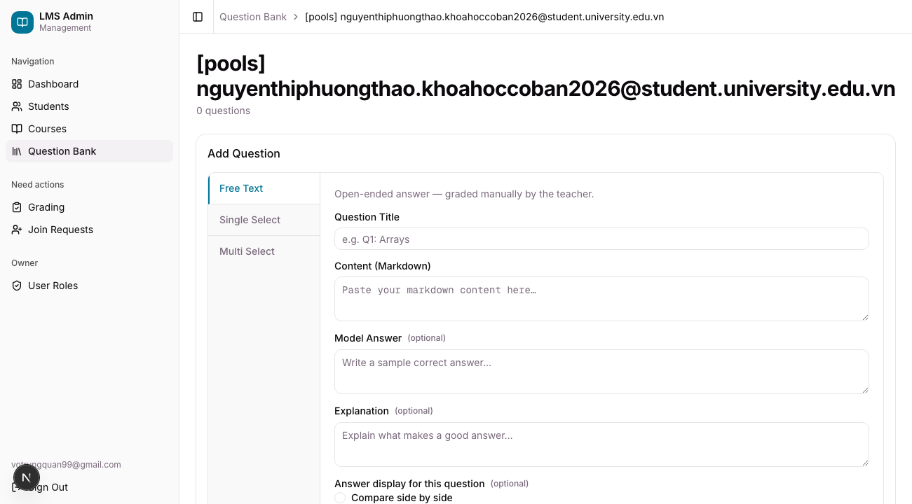

The heading does wrap after its prefix, but the email token itself cannot, so it sets a page minimum of 1301px. **Where:** [pools/[poolId]/page.tsx](../src/app/admin/%28dashboard%29/pools/%5BpoolId%5D/page.tsx). **Fix:** RC1.
- **Severity:** Degraded.

### 11. Student names are sliced mid-character on their cards

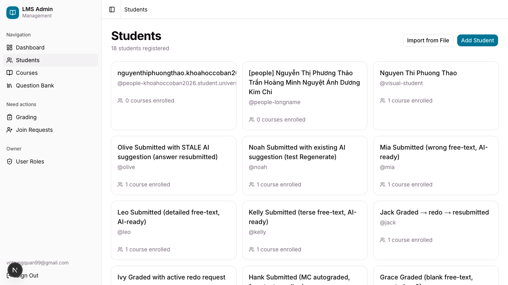

Text starts 18px inside the card border but runs to within 1px of the right border, cut mid-character with no ellipsis. **Where:** [students/page.tsx:67-70](../src/app/admin/%28dashboard%29/students/page.tsx#L67-L70). **Fix:** `break-words` on the title and username, or `truncate` with a `title` attribute so the full value stays reachable.
- **Severity:** Degraded.

### 12. Names are clipped in the Manage Enrollments dialog

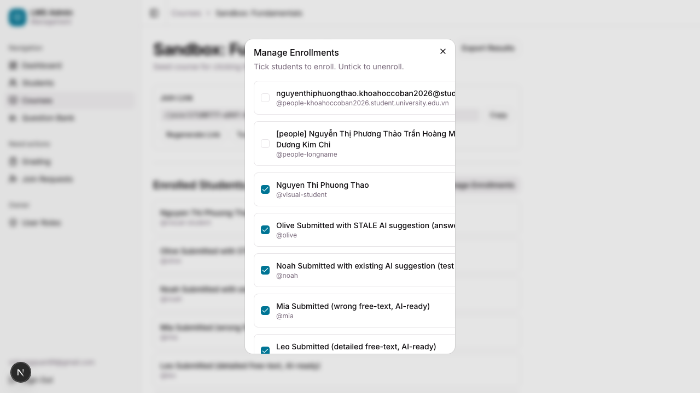

Names read "Olive Submitted with STALE AI suggestion (answ" and stop. The widest row also stretches the list to the panel edge, so every row — including the short ones — loses its right border. **Where:** [enroll-student-form.tsx](../src/app/admin/%28dashboard%29/courses/%5BcourseId%5D/enroll-student-form.tsx). **Fix:** `min-w-0 flex-1` on the name wrapper plus `truncate` on the name and username.
- **Severity:** Degraded.

### 13. A long test title crushes its graded counter

The long title butts straight into the "0/16 graded" counter with no gap and forces it onto two lines, while sibling cards show theirs on one line with clear space. **Where:** [courses/[courseId]/page.tsx:172](../src/app/admin/%28dashboard%29/courses/%5BcourseId%5D/page.tsx#L172) — `flex items-center justify-between` with no `gap`; the title link has no `min-w-0` and the counter link no `shrink-0`. **Fix:** `gap-4` on the row, `shrink-0 whitespace-nowrap` on the counter, `min-w-0` on the title.
- **Root cause:** RC8, not RC1. This title is Vietnamese prose full of spaces and wraps fine; the row is what fails.
- **Severity:** Degraded.
- **Evidence:** `.visual-qa/1280x720/courses/detail-seeded.3.png` (not reproduced here).

### 14. Long student names break the grading card header

Visible in four states. The grading-count pill breaks its own label inside the rounded badge — "0/0" stacked above "graded" — the `@username` drops to its own line, and in the redo state the return arrow falls below its text. **Where:** [grading-detail-student.tsx:177-182](../src/app/admin/%28dashboard%29/grading/page-body/grading-detail-student.tsx#L177-L182) — the count badge sits in a `flex items-center gap-3` with neither `whitespace-nowrap` nor `shrink-0`. **Fix:** add both, and let the title truncate so the name yields space instead of the controls.
- **Root cause:** RC8, not RC1 — "Olive Submitted with STALE AI suggestion (answer resubmitted)" is ordinary spaced text.
- **Severity:** Degraded.
- **Evidence:** `roster-all-students`, `student-blank-free-text`, `student-ai-suggestion`, `student-redo-requested` (not reproduced here).

### 15. A pasted address overflows the student's saved answer panel

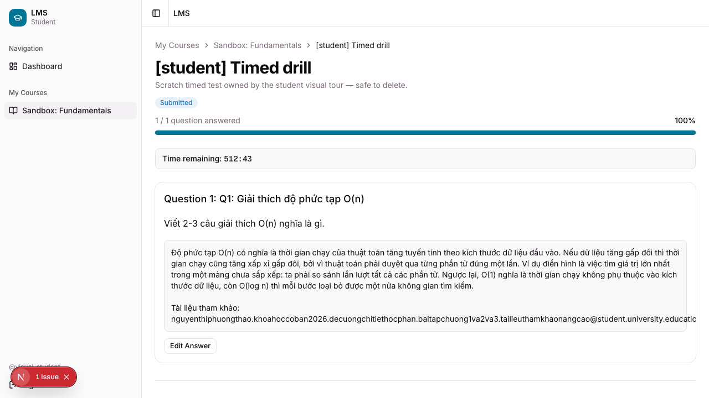

The address runs past the grey panel's border and is cut mid-word at the card's edge. It does not push the page sideways — the overflow is clipped inside the card. **Where:** [answer-form.tsx:160](../src/app/student/%28dashboard%29/courses/%5BcourseId%5D/tests/%5BtestId%5D/answer-form.tsx#L160). The editable textarea already wraps correctly; only the read-only views are affected. **Fix:** add `break-words` — `whitespace-pre-wrap` alone cannot break a token with no spaces.
- **Severity:** Degraded.

### 16. A long pool name crushes its row in the compose panel

The long name pushes the rest of the row aside: its quantity box renders about half the width of the identical boxes below it, and "(0 available)" is forced onto two lines where "(3 available)" sits on one. **Where:** [compose-from-pools-form.tsx](../src/app/admin/%28dashboard%29/courses/%5BcourseId%5D/tests/%5BtestId%5D/compose-from-pools-form.tsx). **Fix:** `min-w-0` plus `break-all` on the label, fixed widths on the count and input.
- **Severity:** Degraded.

### 17. The pool form's status banner is a full-height column

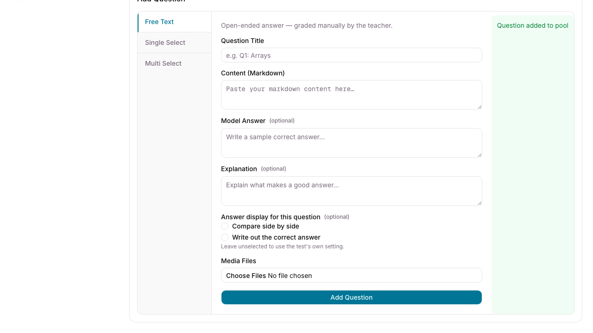

The pool half of RC2, shown here because the pool form is where it was first photographed. **Where:** [add-pool-question-form.tsx:317-329](../src/app/admin/%28dashboard%29/pools/%5BpoolId%5D/add-pool-question-form.tsx#L317-L329).
- **Severity:** Degraded.
- **Not a separate defect:** the same bug as [finding 3](#3-the-add-question-status-banner-renders-as-a-full-height-column), which already cites this file and these lines. Kept as its own entry only because the evidence image is different.

### 18. The form panel is squeezed whenever a status message shows

Without a message the fields run to x≈1219; with one they stop at x≈1041, and the space they lose is a nearly empty coloured strip holding a single line of text. **Fix:** RC2 — once the status blocks leave the flex row they stop consuming a track.
- **Severity:** Degraded.
- **Not a separate defect:** this is the consequence of [finding 3](#3-the-add-question-status-banner-renders-as-a-full-height-column), not a second bug. Listed separately because the squeeze is what an admin actually notices, while the DOM position is what gets fixed.

### 19. The validation error takes the same full-height column

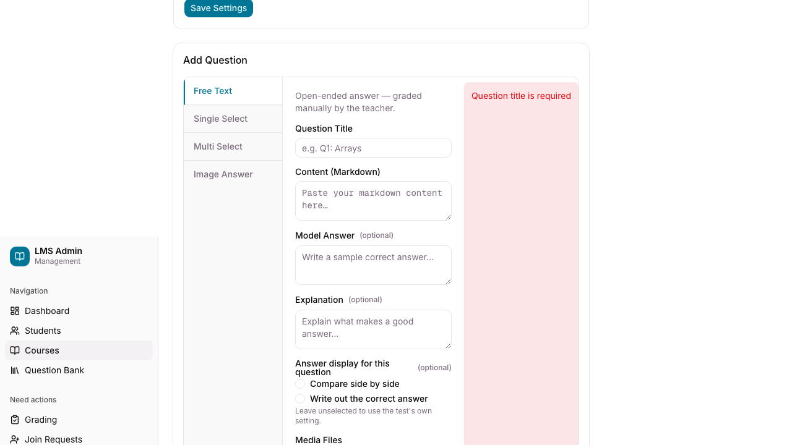

Same structure as the success case, on the failure path. **Fix:** RC2.
- **Severity:** Degraded.
- **Not a separate defect:** [finding 3](#3-the-add-question-status-banner-renders-as-a-full-height-column) on the error branch. One fix closes both branches in both files.

### 20. A long question title is clipped inside the success banner

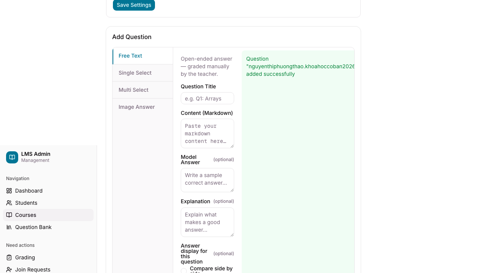

The banner reads `Question "nguyenthiphuongthao.khoahoccoban2026` and then jumps to `added successfully` — the rest of the title and its closing quote are gone, because the flex wrapper carries `overflow-hidden` and the message sets no wrap rule. **Fix:** RC2, plus `overflow-wrap: anywhere` on the message elements.
- **Severity:** Degraded.

### 21. A test reads "Submitted" while it is still open


*(Same capture as [finding 15](#15-a-pasted-address-overflows-the-students-saved-answer-panel), read for a different defect. The "Submit Test for Grading" button named below is on the next tile of this page, not in the image above.)*

- **What's wrong:** The blue "Submitted" badge sits above a running "Time remaining" bar, an "Edit Answer" button and a "Submit Test for Grading" button — none of which would exist if the test had actually been submitted.
- **Where:** [test-status-service.ts:73-75](../src/lib/test-status-service.ts#L73-L75), reached only on the branch where `isSubmitted` is false.
- **Fix:** RC3. Return `InProgress`, or a distinct "Ready to submit" status with its own label, when every question is answered but nothing has been submitted.
- **Severity:** Degraded.

### 22. A running timed test reads "Not Started"

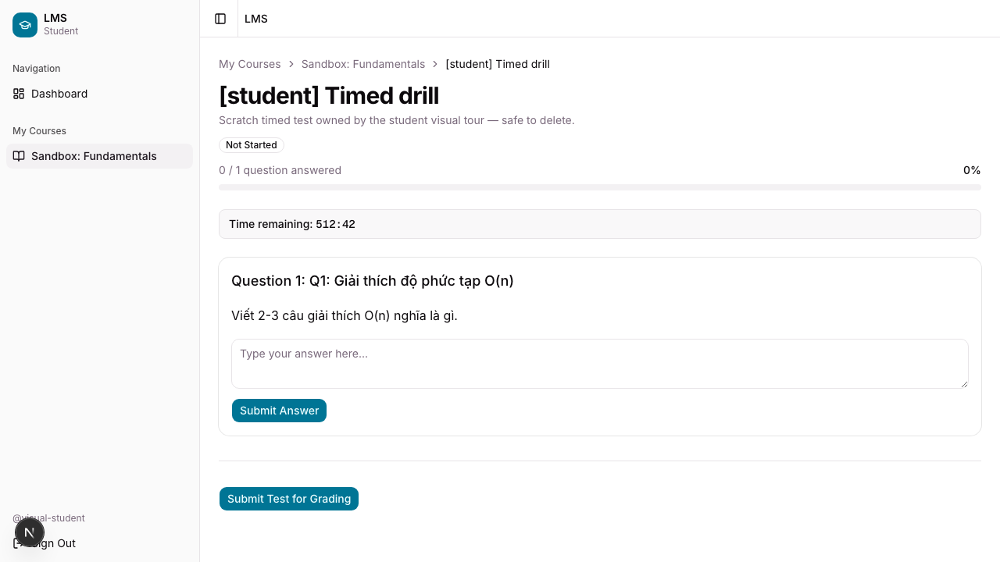

The countdown only renders once a start record exists, so the visible timer proves Start was pressed while the badge says otherwise. **Where:** [test-status-service.ts:57-60](../src/lib/test-status-service.ts#L57-L60). **Fix:** RC3 — derive status from the start record, not from an empty answer list. *(The countdown's value is meaningless in these captures: the browser clock was frozen for reproducibility. Only the badge is the finding.)*
- **Severity:** Degraded.

### 23. "Settings saved" appears while the form shows the opposite

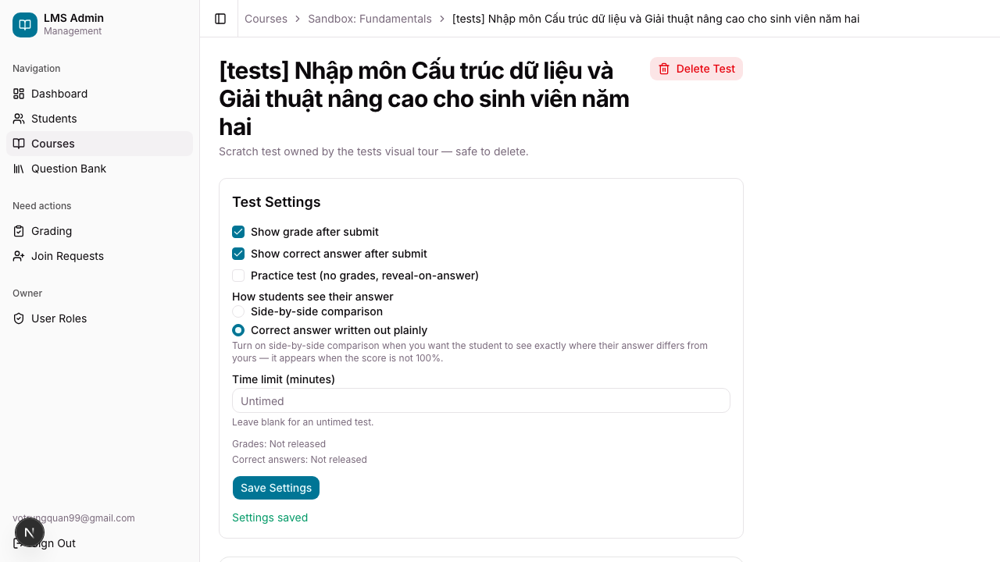

- **What's wrong:** The admin ticks "Practice test", presses Save, and the panel reports **"Settings saved"** while the checkbox has reverted to unticked and the Time limit field is editable again with its untimed hint. The value *is* persisted; the UI contradicts its own confirmation.
- **Where:** [test-settings-panel.tsx:52](../src/app/admin/%28dashboard%29/courses/%5BcourseId%5D/tests/%5BtestId%5D/test-settings-panel.tsx#L52) and [line 57](../src/app/admin/%28dashboard%29/courses/%5BcourseId%5D/tests/%5BtestId%5D/test-settings-panel.tsx#L57).
- **Why it happens:** The panel is a `<form action={formAction}>`, and React 19 automatically resets such a form once the action resolves. The Radix checkbox registers a `reset` listener that restores its mount-time value (`@radix-ui/react-checkbox/dist/index.mjs:90-92`); in controlled mode that fires `onCheckedChange(false)` and clears the local `practice` state, which the time-limit field's `disabled` and hint both key off.
- **Fix:** Neutralise the auto-reset rather than re-syncing after it. Drive the checkbox from the value the action returns instead of local `useState`, so the reset has nothing stale to restore.
- **Likelihood:** Every save of this panel.
- **Severity:** Degraded.

### 24. Releasing grades produces no feedback at all

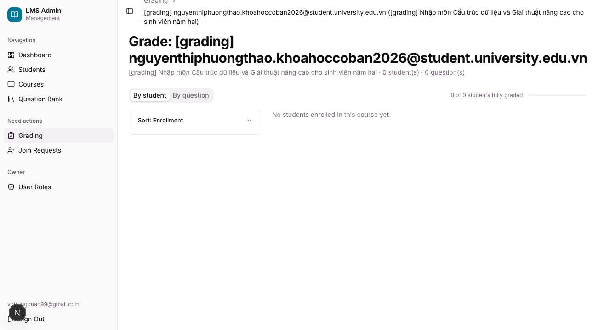

- **What's wrong:** After releasing, the button vanishes, the page reflows upward, and nothing anywhere says the grades are now released. The admin cannot tell whether it worked.
- **Where:** [grading/[testId]/page.tsx](../src/app/admin/%28dashboard%29/grading/%5BtestId%5D/page.tsx).
- **Why it happens:** The action calls `revalidatePath`, and the page gates the button on `!test.gradesReleasedAt` — so the re-render unmounts the button together with the "Grades released ✓" message it was about to show.
- **Fix:** Render a persistent "Grades released" line in the header whenever `gradesReleasedAt` is set, instead of rendering nothing.
- **Severity:** Degraded. Off-checklist — the catalogue has no entry for this, so the severity is an estimate.

### 25. Question types are named three different ways

A card's summary says "Type: Single choice" while the radio directly below it says "Single Select"; "Multiple choice" versus "Multi Select"; and the AI import page calls the open-ended type "Free response" where the Add Question tabs call it "Free Text". **Fix:** RC7 — one exported label map used in all three places.
- **Severity:** Degraded.

### 26. The answer-display setting carries three headings on one page

The test-level default reads "How students see their answer" / "Side-by-side comparison"; the per-question override in the Add Question card reads "Answer display for this question" / "Compare side by side"; the same override in the edit form reads "How this question shows its answer" / "Show side-by-side for this question". **Fix:** RC7.
- **Severity:** Degraded.

### 27. An empty pool can be ticked, and reports success having added nothing

A pool labelled "(0 available)" is tickable like any other, with its draw-count pre-filled to 1. Ticking it and pressing Add from Pools does not fail — it returns a green **"Added 0 questions from pools"**. **Where:** [compose-from-pools-form.tsx](../src/app/admin/%28dashboard%29/courses/%5BcourseId%5D/tests/%5BtestId%5D/compose-from-pools-form.tsx). **Fix:** `disabled={pool.questionCount === 0}` on the row checkbox, matching the `disabled` already applied to its count input.
- **Severity:** Degraded.

### 28. After a compose, a row's tick and its count box disagree

The checkbox is drawn unticked while its count box still shows an active dark "2" on white, where the other unticked rows show greyed counts. Both read the same `selection.selected`, so they can only disagree if the DOM checkbox was cleared outside React's render. **Fix:** clear the selection state explicitly on a successful compose.
- **Severity:** Degraded.

### 29. The Create Course error is separated from the field it refers to

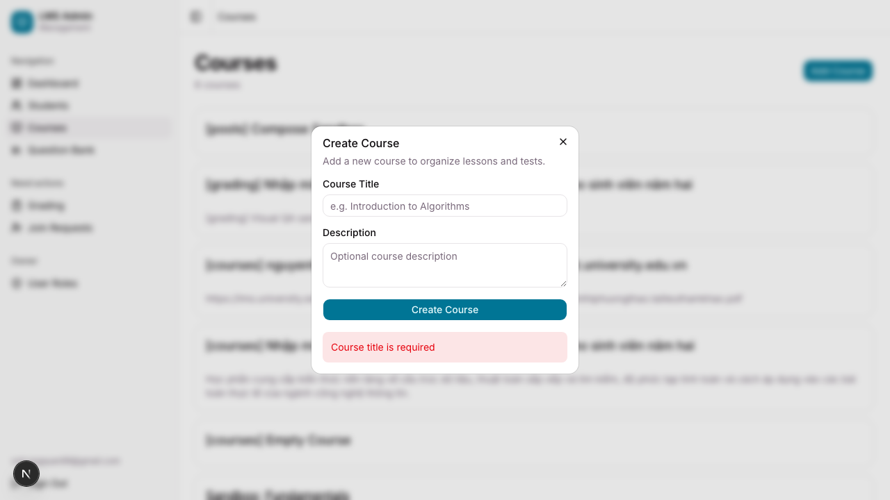

"Course title is required" renders at the dialog's bottom edge, with the Description textarea *and* the submit button between it and the empty Course Title input. **Where:** [create-course-form.tsx](../src/app/admin/%28dashboard%29/courses/create-course-form.tsx). **Fix:** move the error beneath the title input and set `aria-invalid` on it.
- **Severity:** Degraded.

### 30. Export Results shows two empty headings and no explanation

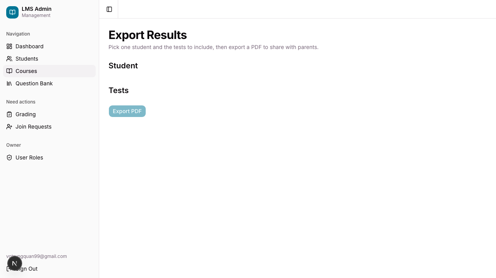

Both headings render with blank space underneath and a greyed-out Export PDF button, with nothing saying why there is nothing to choose. **Where:** [results-report-selection.ui.tsx](../src/app/admin/%28dashboard%29/courses/%5BcourseId%5D/results-report/results-report-selection.ui.tsx). **Fix:** return a muted message from each list when it is empty.
- **Severity:** Degraded.

### 31. The Export Results page has no breadcrumb

Its top bar holds only the sidebar toggle, where every other course page shows the "Courses › …" trail — so the page never names which course is being exported and offers no link back. There is no `@breadcrumb/courses/[courseId]/results-report` slot, so the parallel route falls back to `default.tsx`, which returns `null`. **Fix:** add the missing slot.
- **Severity:** Degraded. Off-checklist — the catalogue has no entry for this, so the severity is an estimate.

### 32. A refused Create Student submit wipes everything typed

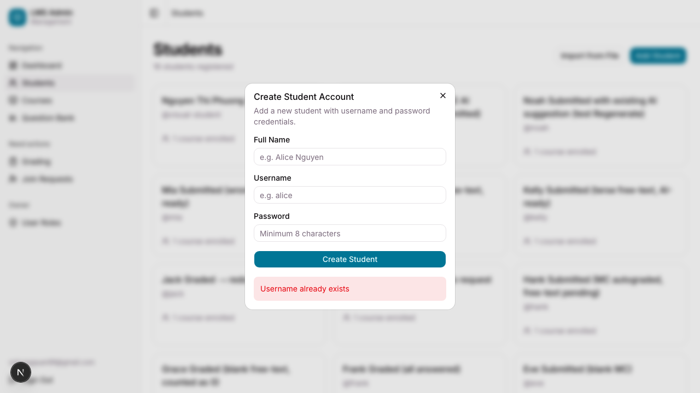

All three fields show their grey placeholders again after the server refuses, even though the error asks the admin to correct just one value. **Where:** [create-student-dialog.tsx](../src/app/admin/%28dashboard%29/students/create-student-dialog.tsx). **Fix:** carry the submitted name and username (not the password) back in the action state and set them as `defaultValue`.
- **Severity:** Degraded. Off-checklist — the catalogue has no entry for this, so the severity is an estimate.

### 33. The login error names a field that is not the problem

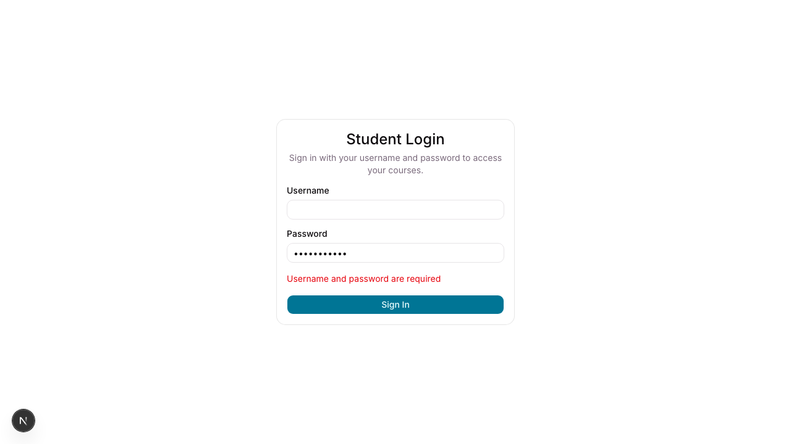

The Password field visibly holds a value while Username is empty, yet the error reads "Username and password are required" — naming a field that is fine and never saying which one is blank. **Where:** [student-login-form.tsx](../src/app/student/login/student-login-form.tsx). **Fix:** per-field checks, each rendered beneath its own input.
- **Severity:** Degraded.

### 34. An unanswered blank is gradable in one view and not the other

The same student's blank answer gets a score box, feedback field and Save Grade in "By question" mode, but only an italic "No answer submitted" with no inputs in "By student" mode — and the two views word it differently. **Fix:** pick one behaviour and one wording for both pivots.
- **Severity:** Degraded. Off-checklist — the catalogue has no entry for this, so the severity is an estimate.

### 35. Two buttons labelled "Regenerate" mean different things

One in the student card header regenerates AI grading for the whole submission; one in the AI suggestion panel does a single question. Both are labelled exactly "Regenerate" and are visible at once. **Fix:** "Regenerate all" and "Regenerate this answer".
- **Severity:** Degraded. Off-checklist — the catalogue has no entry for this, so the severity is an estimate.

### 36. The admin dashboard is two-thirds empty while one card is squeezed

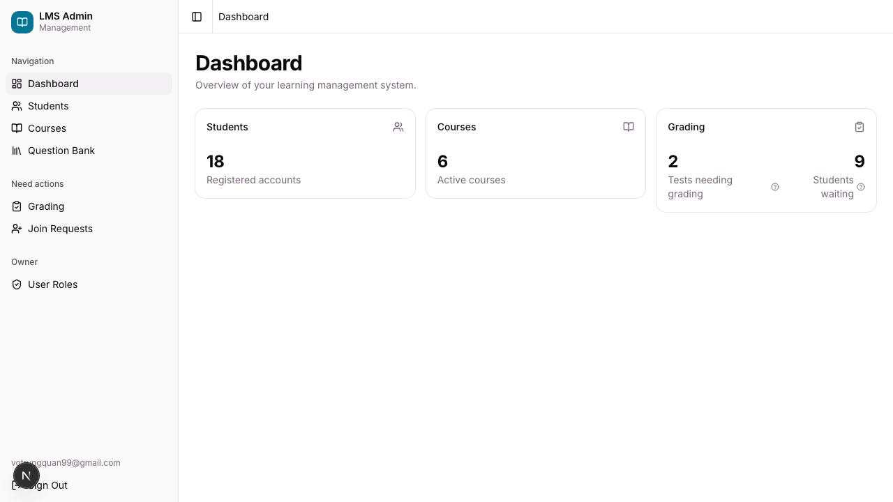

Everything below the single row of stat cards is blank for roughly the lower two thirds of the page, while the Grading card in that row packs two metrics into a peer-width tile and wraps both labels onto two lines. **Where:** [dashboard/page.tsx](../src/app/admin/%28dashboard%29/dashboard/page.tsx). **Fix:** fill the space with the queues the sidebar already advertises. *(Possibly intended — this may simply be an unfinished page.)*
- **Severity:** Degraded.
- **Note:** [finding 42](#42-the-grading-card-is-taller-than-its-two-peers) is the same wrapped Grading card seen as a height mismatch. One fix closes both; they are counted as one defect.

### 37. The "By question" panel stretches the whole page

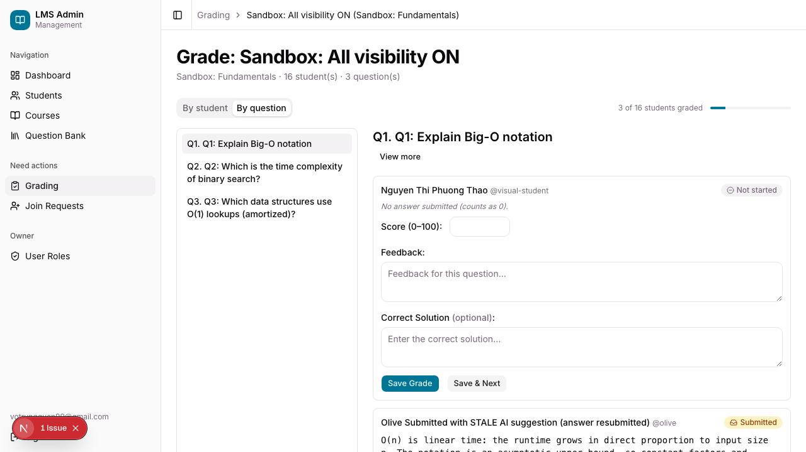

The bordered question-list panel stretches to match the full height of 16 stacked grading forms — roughly nine screens — so an outlined empty box runs the entire page with three links at the very top. **Where:** [grading-page-shell.ui.tsx:34](../src/app/admin/%28dashboard%29/grading/page-body/grading-page-shell.ui.tsx#L34) — `grid grid-cols-[18rem_1fr] gap-6`, whose default `align-items: stretch` stretches the aside to the row height. **Fix:** `items-start` on the grid, and make the panel sticky so it stays in view.
- **Severity:** Degraded.
- **Note:** `TwoPaneShell` is shared, so the by-student roster stretches the same way; this is not specific to the by-question pivot.

### 38. The test page wastes a third of its width while its own rows wrap

Every card stops about two-thirds across the content area with the strip to its right empty, while inside the Add from Pools card the rows wrap pool names onto two lines and split counts as "(0" / "available)". The same form on the pool detail page gets full width. **Fix:** widen the `max-w-2xl` wrappers, or centre the column.
- **Severity:** Degraded.

### 39. An expired invite link is a dead end

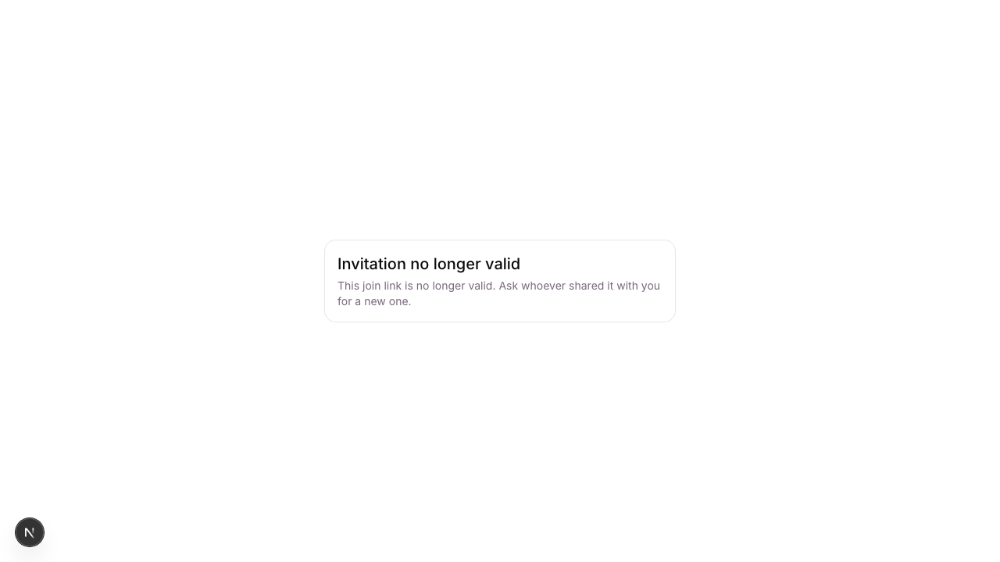

- **What's wrong:** The card holds a title and a sentence and nothing else — no button, no link, no sign-in route. A visitor who clicks a stale invite, including an existing student who just wanted to sign in, is left with no way into the app.
- **Where:** [join/[token]/join-page.ui.tsx](../src/app/join/%5Btoken%5D/join-page.ui.tsx).
- **Fix:** add links to `/student/login` and `/`, matching the two recovery actions the 403 page already offers.
- **Note:** this was *refuted* as the catalogue's `unrecoverable-error-page` (which requires a recovery action that fails the same way — this page has no recovery action at all) and is kept here as an off-checklist finding instead.
- **Severity:** Degraded. Off-checklist — the catalogue has no entry for this, so the severity is an estimate.

---

### 40. "Return Home" and "Sign Out" don't match

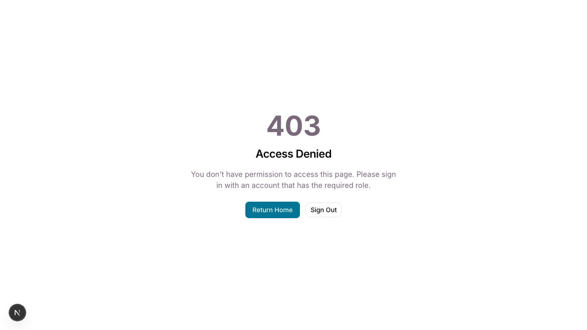

Return Home is 36px tall against Sign Out's 28px, with tighter corners. **Where:** [forbidden.tsx](../src/app/forbidden.tsx) hand-rolls it as a styled `<Link>`. **Fix:** RC6 — `<Button asChild><Link/></Button>`.
- **Severity:** Cosmetic.

### 41. The two join buttons are different heights

Create Account is 30px, Continue with Google is 36px, offered as a straight either/or across an "or" divider. **Fix:** RC6 — one size for the pair.
- **Severity:** Cosmetic.

### 42. The Grading card is taller than its two peers

Students and Courses both end at y=283; Grading runs to y=303, because its two labels each wrap to two lines. **Fix:** `h-full` on each grid item and its card.
- **Severity:** Cosmetic.

### 43. Grading hub cards have no gap between them

Adjacent cards share an edge, their rounded corners meeting and pinching into a visible notch. The section uses `space-y-3`, but each card is wrapped in a `Link` rendering an inline `<a>`, which ignores vertical margin. **Fix:** add `className="block"` to the Link, or make the section `flex flex-col gap-3`.
- **Severity:** Cosmetic. Off-checklist — the catalogue has no entry for this, so the severity is an estimate.

### 44. The Admin badge is knocked out of line by an error message

On the row where a role action was refused, the error sentence is wider than the button above it, widening that column and pushing the Admin badge left of the Student badges above it. **Where:** [role-action-buttons.tsx:36-45](../src/app/admin/%28dashboard%29/user-roles/role-action-buttons.tsx#L36-L45) — the button and its error stack in a `flex flex-col items-end`, so the error's width sets the form's width. **Fix:** render the error in a fixed-width slot so showing it cannot move the badge column.
- **Root cause:** RC8.
- **Severity:** Cosmetic.

### 45. "No tests yet" is centred while its sibling empty states are not

"No students enrolled yet." and "No materials yet." both start at x=280; "No tests yet. Create one above." is centred. **Fix:** drop `text-center`.
- **Severity:** Cosmetic.

### 46. "Add Test" is stranded above its own heading

Add Test sits on its own row above the "Tests" heading, and on a course with no tests the heading disappears entirely while "Enrolled Students (0)" and "Materials (0)" keep theirs. **Fix:** move the heading out of the length check and onto a flex row with the trigger.
- **Severity:** Cosmetic. Off-checklist — the catalogue has no entry for this, so the severity is an estimate.

### 47. "Retry with AI" looks like a caption

A real button with `variant="ghost"` — no border, background or underline — sitting between an outlined badge and an outlined Edit button. **Fix:** `variant="outline"`.
- **Severity:** Cosmetic.

### 48. The submit confirmation reads "You have answered all 1 question."

The noun is pluralised but the literal "all" is not, on the confirmation of an irreversible action. **Where:** [submit-test-button.tsx:51-56](../src/app/student/%28dashboard%29/courses/%5BcourseId%5D/tests/%5BtestId%5D/submit-test-button.tsx#L51-L56). **Fix:** branch the copy on a single question.
- **Severity:** Cosmetic. Off-checklist — the catalogue has no entry for this, so the severity is an estimate.

### 49. Multiple-choice controls use the browser's blue, not the app's teal

The checked radio measures `rgb(0,117,255)` — Chromium's default accent — while the button on the same page is `rgb(0,117,149)`. The inputs are bare `<input type="radio">` with no theming. **Fix:** use the project's own Checkbox/RadioGroup, or set `accent-color`.
- **Severity:** Cosmetic. Off-checklist — the catalogue has no entry for this, so the severity is an estimate.

### 50. Submit Answer stays enabled with nothing to submit

The button is enabled while the answer box is empty and no option is ticked; pressing it can only return "Answer cannot be empty" inline beside it. Downgraded to cosmetic: the error is clear and adjacent, so nothing breaks — the control simply invites a submission guaranteed to be rejected.
- **Severity:** Cosmetic.

---

### 51. Pool question previews show raw markdown

The pool detail page prints `question.content` raw, asterisks and all, while the same
question drawn into a test renders through the markdown renderer — so identical text reads
as formatted on one screen and as source on the other.
**Where:** [pools/[poolId]/page.tsx](../src/app/admin/%28dashboard%29/pools/%5BpoolId%5D/page.tsx).
**Fix:** render the preview through the same markdown renderer, keeping the line clamp.
- **Severity:** Cosmetic. Off-checklist — the catalogue has no entry for this, so the severity is an estimate.

### 52. The countdown has no hours field and no units

`formatMmSs` emits `mm:ss` with no rollover into hours, so a two-hour exam legitimately
renders as "120:00" and the reader cannot tell hours:minutes from minutes:seconds.
**Where:** [countdown.state.tsx:18-22](../src/app/student/%28dashboard%29/courses/%5BcourseId%5D/tests/%5BtestId%5D/countdown.state.tsx#L18-L22).
**Fix:** roll over into `h:mm:ss` past 60 minutes, or label the units.
*(The countdown VALUE in these captures is meaningless — the browser clock was frozen. Only
the format is the finding.)*
- **Severity:** Cosmetic. Off-checklist — the catalogue has no entry for this, so the severity is an estimate.

---

## Entries that are one defect

The report has 52 numbered entries but **48 distinct defects**. Four clusters are one bug seen
more than once, and they are listed separately only because each has its own evidence:

- **3, 17, 18 and 19 are one bug.** The status block sits inside a flex row, in two files, on
  both the success and the error branch. Finding 3 already cites both files. Counted once.
- **36 and 42 are one bug** — the Grading card's wrapped labels, seen once as dead space and
  once as a height mismatch.
- **6 and 7 are one overflowing page**, counted once as a button pushed off screen and once as
  the sideways scroll that put it there.
- **16 and 38 share evidence.** They attribute the cramped pool row to different causes — a long
  name versus a narrow column — but fixing either closes the visible symptom.

This matters for the root-cause credit: RC2's "5 findings" is one DOM-position bug counted
five times. Only finding 20 is genuinely separate from it.

## Noticed, but not on the checklist

**Findings 2, 4, 5, 24, 31, 32, 34, 35, 39, 43, 46, 48, 49, 51 and 52** had no matching entry
in the 85-item catalogue. Each is marked off-checklist where it appears above, and each is
also a candidate new catalogue entry.

These are not lesser findings. Their severities are estimates rather than catalogue defaults,
but this section holds the `/redirect` 500, the partial-credit setting no one can reach, and
the blank answer counted as graded — three of the most consequential things in the report.
The same was true of the first trial of this method, where the single worst defect found came
from off the checklist.

That 15 of 52 findings fall outside an 85-entry list is itself a result: the catalogue is
tuned for layout defects a screenshot shows, and it has almost nothing to say about a screen
that lies about what just happened.

## Repairs made

Two changes were made to the repo during this pass, neither related to any finding above:

**`scripts/seed-test-states.ts` could not run.** `AnswerService` and `TestSubmissionService`
had both gained constructor parameters (`testService`, `testStartService`) that the script
never passed, so seeding died on the third student with
`TypeError: undefined is not an object (evaluating 'this.testService.getTest')`. The wiring
was corrected to match [services-singleton.ts:96](../src/lib/services-singleton.ts#L96). The
script is documented developer tooling (`scripts/instruction.md`) and had been silently broken
for anyone since those constructors changed.

**`.gitignore` gained `.visual-qa/`.** The capture archive is machine-specific and must never
be committed; this report folder deliberately is not ignored.

## Not covered by this pass

**Tiers captured:** all 72 of tier 1, 17 of the 18 tier-2 states, and 2 of the 4 tier-3 —
**91 in total**, matching the header. The tier ranking is by how likely a state is to hurt
someone, not by how many code branches exist.

**25 states were planned but not captured.** 22 carry a `[skip]` tag with the source line
proving them unreachable — the user-roles truncation banner needs 101 sign-in accounts, the
"Account Not Set Up" login variants need a completed Google OAuth round trip, a "too few
cards" warning that auto-fill makes impossible. The other three were tagged with a tier and
simply never reached: `tests/edit-confirm-dialog` [T2], `pools/not-found` [T3] and
`tests/add-image-answer` [T3]. All are listed in
[e2e/visual/states.md](../e2e/visual/states.md).

**Not looked at at all:**

- **Every viewport except 1280×720.** Mobile was not captured, and mobile is where layouts break hardest. All eleven RC1 overflow findings would very likely be worse at 375px, and there may be mobile-only defects this pass cannot see.
- **Anything needing interaction** — hover states, keyboard focus, focus order, keyboard traps, click-target sizes. A still image cannot show these, and they were deliberately excluded rather than guessed at.
- **Dark mode.**
- **The image-answer question type**, which no seeded question uses.
- **Real AI grading.** The provider is mocked in this environment, so the AI import screen shows canned text ("MSW mock: Gemini call intercepted"). Its layout is real; its wording is not.
- **The student-side graded view, the redo banner and the practice reveal panel**, each needing an admin action this pass did not perform.

## What this is worth

This is a net, not a gate. On measured evidence this kind of review catches roughly 40% of
real defects and roughly 40% of what it reports is wrong. **A clean screen means nothing was
found — never that the screen is correct.**

In this run 53 candidates were produced and 3 were refuted by the adversarial pass, a 5.7%
rejection rate against the ~40% expected. Read that with suspicion rather than pride. A
later audit of this report found no false findings but plenty of false *precision* — a wrong
file citation, an inflated "eleven screens", an image filed under the wrong finding, a root
cause that claimed one fix for defects it could not fix, and several counts that did not add
up. All are corrected above. The lesson is that a low refutation rate measures how well the
findings survive attack, not how well the write-up around them holds together.

The true false-positive rate is not 5.7%. It is however many of these 52 you read and reject.
That number is yours to produce, and it is the only honest measure of whether this was worth
running.

Worth noting about what found what: your original bug is a layout problem a screenshot shows
plainly, and the screenshot review found it twice, independently, without being told to look.
But the `/redirect` 500, the unreachable partial-credit setting, the blank-answer grading
badge and the React-19 form reset were all found by driving the app and reading code. A
picture got the agents into those states; it did not identify the defects.
